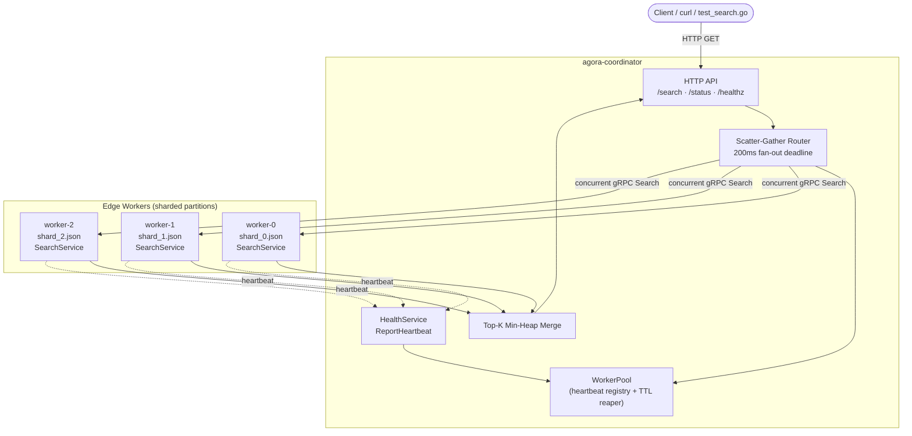

# Agora

**A fault-tolerant, sharded edge-network information retrieval (IR) engine — built from scratch in Go.**

Agora is a distributed search system that shards document corpora across edge worker nodes, executes **custom BM25 ranking** on each shard, and merges globally ranked results through a coordinator. There is no Elasticsearch, no Lucene, and no external database: the inverted index, tokenizer, and scoring algorithm are implemented in idiomatic Go.

This project demonstrates production-oriented systems engineering — gRPC service contracts, scatter-gather query routing, graceful degradation under node failure, structured observability, and containerized local orchestration.

---

## Highlights

| Area | What Agora demonstrates |
|------|-------------------------|
| **Distributed systems** | Scatter-gather fan-out, bounded deadlines, partial-result semantics, dynamic worker registry |
| **Information retrieval** | In-memory inverted index, posting lists, BM25 ranking with configurable `k1` / `b` |
| **Concurrency** | `sync.RWMutex` for read-heavy index access, goroutine fan-out with `sync.WaitGroup` |
| **RPC & contracts** | Protocol Buffers (`proto3`) + gRPC for inter-node communication |
| **Reliability** | Push heartbeats, TTL-based eviction, automatic re-registration on recovery |
| **Operations** | Docker Compose cluster, structured JSON logging (`slog`), HTTP client API |
| **Quality** | Race-detector-tested index package, table-driven unit tests with exact BM25 score assertions |

---

## Architecture



### Request path

1. **Client** sends a search query to the coordinator over HTTP.
2. **Coordinator** looks up all *alive* workers in the `WorkerPool`.
3. **Scatter:** the router fans the same `SearchRequest` to every worker concurrently (goroutines + `WaitGroup`), bounded by a strict context deadline (default **200ms**).
4. **Local search:** each worker tokenizes the query, scores candidate documents with **BM25** against its in-memory inverted index, and returns its local top-K.
5. **Gather & merge:** the coordinator collects partial result slices and runs a **bounded min-heap merge** to produce the global top-K without materializing all hits.
6. **Graceful degradation:** workers that time out or error are listed in `degraded_nodes`; surviving workers still return a useful response.

### Failure handling

| Event | Behavior |
|-------|----------|
| Worker slow / unreachable | Marked `degraded_nodes`; query succeeds with partial results |
| Worker process killed | Still in pool until heartbeat TTL expires (~3s), then evicted by background reaper |
| Worker restarted | Re-registers automatically via push heartbeat — no manual config reload |

---

## Tech stack

- **Language:** Go 1.22+
- **RPC:** gRPC + Protocol Buffers (`proto3`)
- **Logging:** `log/slog` (structured JSON)
- **Orchestration:** Docker Compose (1 coordinator + 3 workers)
- **Dependencies:** `google.golang.org/grpc`, `google.golang.org/protobuf` only — no search library, no ORM, no external index store

---

## Repository layout

```text
Agora/
├── proto/
│   ├── agora.proto              # gRPC service & message definitions
│   └── agorapb/                 # Generated Go stubs (buf / protoc)
├── pkg/index/                   # Core IR engine
│   ├── index.go                 # Thread-safe inverted index + BM25 scorer
│   ├── tokenizer.go             # Normalization + stop-word filtering
│   ├── corpus.go                # JSON shard loader
│   └── index_test.go            # Ranking, exact-score, concurrency tests
├── cmd/
│   ├── worker/                  # agora-worker binary
│   └── coordinator/             # agora-coordinator binary
├── data/
│   ├── shard_0.json             # US legislative corpus (6 docs)
│   ├── shard_1.json             # EU / UK legislative corpus (6 docs)
│   └── shard_2.json             # Global geopolitical corpus (6 docs)
├── deploy/
│   ├── Dockerfile               # Multi-stage build (coordinator + worker)
│   └── docker-compose.yml       # Local 1+3 cluster
├── scripts/
│   ├── run_local.sh             # Process-based cluster launcher (no Docker)
│   └── test_search.go           # Latency benchmark + failover harness
├── internal/logging/            # Shared slog setup
├── Makefile                     # proto, build, test, compose targets
└── buf.gen.yaml                 # Protobuf code generation config
```

---

## Quick start

### Prerequisites

- Go 1.22+
- [buf](https://buf.build/docs/installation) or `protoc` + Go plugins (for regenerating stubs)
- Docker & Docker Compose *(optional — for containerized cluster)*

### Build

```bash
make build          # → bin/agora-coordinator, bin/agora-worker
make test           # run all tests (includes race-safe index tests)
```

### Option A — Docker Compose (recommended)

```bash
make up
# or: docker compose -f deploy/docker-compose.yml up --build
```

Query the cluster:

```bash
curl "http://localhost:8080/search?q=climate+treaty+sanctions&k=5"
curl "http://localhost:8080/status"
curl "http://localhost:8080/healthz"
```

Simulate single-node failure:

```bash
docker compose -f deploy/docker-compose.yml stop worker-2
curl "http://localhost:8080/search?q=climate+treaty+sanctions&k=5"
# → partial results; worker-2 appears in "degraded_nodes"
```

Tear down:

```bash
make down
```

### Option B — Local processes (no Docker)

```bash
./scripts/run_local.sh up       # build + start 1 coordinator + 3 workers
./scripts/run_local.sh status   # print cluster status JSON
./scripts/run_local.sh down     # stop all processes
```

Logs are written to `.run/*.log`.

---

## HTTP API

Base URL: `http://localhost:8080`

### `GET /search`

Execute a distributed BM25 search across all alive workers.

| Parameter | Required | Description |
|-----------|----------|-------------|
| `q` | yes | Search query string |
| `k` | no | Global top-K (default: `10`) |
| `f_<key>` | no | Metadata filter (ANDed). Example: `f_region=eu` |

**Example**

```bash
curl -s "http://localhost:8080/search?q=energy&k=5&f_region=us" | jq .
```

**Response**

```json
{
  "query": "energy",
  "results": [
    {
      "doc_id": "us-senate-001",
      "score": 0.999,
      "text_snippet": "The United States Senate passed a sweeping climate bill...",
      "node_id": "worker-0"
    }
  ],
  "execution_time_ms": 1,
  "served_by": ["worker-0", "worker-1", "worker-2"],
  "degraded_nodes": []
}
```

### `GET /status`

Returns the coordinator's view of registered, alive workers (post-heartbeat, pre-TTL-eviction).

### `GET /healthz`

Coordinator liveness probe (`{"status":"ok"}`).

---

## gRPC services

Defined in [`proto/agora.proto`](proto/agora.proto).

| Service | RPC | Implemented by | Purpose |
|---------|-----|----------------|---------|
| `SearchService` | `Search` | Worker | Local BM25 search over a shard |
| `HealthService` | `Check` | Worker | Pull-based health probe |
| `HealthService` | `ReportHeartbeat` | Coordinator | Push-based worker registration / liveness |

Key messages:

- **`SearchRequest`** — `query`, `top_k`, `filters[]`, `request_id`
- **`SearchResponse`** — `results[]`, `execution_time_ms`, `served_by[]`, `degraded_nodes[]`
- **`Heartbeat`** — `node_id`, `address`, `active`, `document_count`

Regenerate stubs after editing the proto:

```bash
make proto          # via buf (preferred)
make proto-protoc   # via protoc + local plugins
```

---

## Search engine internals

Agora's IR core lives in [`pkg/index/`](pkg/index/). It is deliberately small, readable, and testable.

### Inverted index

- **Structure:** `map[term][]posting` where each posting holds `(doc_id, term_frequency)`
- **Concurrency:** single `sync.RWMutex` — many concurrent searches under `RLock`, ingestion under `Lock`
- **Metadata:** per-document key/value filters (e.g. `region=us`) applied at scoring time

### Tokenizer

- Split on non-alphanumeric runes (punctuation stripped)
- Lowercase normalization
- Basic English stop-word removal (`the`, `and`, `of`, …)

### BM25 scoring

Per query term \(q_i\) against document \(D\):

\[
\text{score}(D, Q) = \sum_{q_i \in Q} \text{IDF}(q_i) \cdot \frac{f(q_i, D) \cdot (k_1 + 1)}{f(q_i, D) + k_1 \cdot \left(1 - b + b \cdot \frac{|D|}{\text{avgdl}}\right)}
\]

**IDF** uses the probabilistic "plus-one" form to avoid negative values for very common terms:

\[
\text{IDF}(q) = \ln\left(1 + \frac{N - n(q) + 0.5}{n(q) + 0.5}\right)
\]

| Symbol | Meaning | Default |
|--------|---------|---------|
| \(k_1\) | Term-frequency saturation | `1.2` |
| \(b\) | Length-normalization strength | `0.75` |
| \(N\) | Total documents in shard | computed |
| \(n(q)\) | Documents containing term \(q\) | computed |
| \(\text{avgdl}\) | Average document length (tokens) | computed |

### Global top-K merge

Each worker returns its local top-K. The coordinator merges with a **min-heap of size K** — \(O(M \log K)\) where \(M\) is the total hits across workers, without storing the full cross-shard result set.

---

## Configuration

All settings are overridable via CLI flags or environment variables.

### Coordinator

| Env var | Flag | Default | Description |
|---------|------|---------|-------------|
| `AGORA_NODE_ID` | `-node-id` | `coordinator` | Node identifier |
| `AGORA_HTTP` | `-http` | `:8080` | Client HTTP listen address |
| `AGORA_GRPC` | `-grpc` | `:9000` | Heartbeat gRPC listen address |
| `AGORA_FANOUT_MS` | — | `200` | Scatter-gather deadline (ms) |
| `AGORA_HEARTBEAT_TTL_MS` | — | `3000` | Evict workers without heartbeat (ms) |
| `AGORA_LOG_LEVEL` | — | `info` | `debug` · `info` · `warn` · `error` |

### Worker

| Env var | Flag | Default | Description |
|---------|------|---------|-------------|
| `AGORA_NODE_ID` | `-node-id` | `worker-0` | Unique worker id |
| `AGORA_LISTEN` | `-listen` | `:9101` | gRPC listen address |
| `AGORA_ADVERTISE` | `-advertise` | *(listen addr)* | Address sent to coordinator |
| `AGORA_SHARD` | `-shard` | `data/shard_0.json` | Document partition file |
| `AGORA_COORDINATOR` | `-coordinator` | *(empty)* | Coordinator gRPC for heartbeats |
| `AGORA_HEARTBEAT_MS` | — | `1000` | Heartbeat push interval (ms) |
| `AGORA_LOG_LEVEL` | — | `info` | Log level |

---

## Benchmarking & fault tolerance

A Go benchmark harness exercises the coordinator under load and reports latency percentiles plus which nodes served or degraded.

```bash
# 500 requests, 32 concurrent clients
go run ./scripts/test_search.go -q "climate treaty sanctions" -k 5 -n 500 -c 32
```

**Observed on a local 1-coordinator / 3-worker cluster** (Apple Silicon, no Docker):

| Metric | Value |
|--------|-------|
| Throughput | ~12,900 req/s |
| Latency p50 | ~2.2 ms |
| Latency p95 | ~4.5 ms |
| Latency p99 | ~6.8 ms |
| Failures | 0 (all workers healthy) |

**Failover scenario** (kill one worker mid-flight):

1. Next query returns **partial results** with the dead node in `degraded_nodes` — no client error.
2. After the heartbeat TTL (~3s), the reaper evicts the node from the pool.
3. Restarting the worker **auto re-registers** via heartbeat; cluster returns to full capacity.

---

## Testing

```bash
go test ./...                  # all packages
go test -race ./pkg/index/     # index concurrency + BM25 correctness
```

The index test suite covers:

- Tokenizer normalization and stop-word removal
- BM25 ranking order (higher TF → higher score)
- **Exact BM25 score** against a hand-computed expected value
- Metadata filter matching
- Top-K bounding
- Concurrent read/write under the race detector

---

## Design decisions

**Why no external search library?**  
To own the full retrieval stack — posting list layout, IDF computation, length normalization, and merge semantics — and to keep the project deployable as a single static binary per role.

**Why push heartbeats instead of only pull health checks?**  
Workers at the edge may come and go; push registration lets the coordinator maintain an eventually-consistent view without polling every node on every query.

**Why partial results instead of failing the request?**  
Edge networks are lossy. Returning the best available ranked hits (with explicit `degraded_nodes`) is more useful for clients than a hard 503 when one shard is slow.

**Why a single RWMutex per index?**  
Per-shard corpora are small enough that lock striping adds complexity without measurable gain. `RWMutex` matches the read-heavy search workload and keeps `avgdl` / `docCount` trivially consistent.

**Why structured JSON logs?**  
Every log line carries `component` and `node_id`, making it straightforward to correlate scatter-gather traces across a multi-node run.

---

## Make targets

| Target | Description |
|--------|-------------|
| `make proto` | Regenerate Go stubs from `proto/agora.proto` (buf) |
| `make build` | Build coordinator and worker binaries into `bin/` |
| `make test` | Run all tests |
| `make up` | Start Docker Compose cluster |
| `make down` | Stop and remove Compose services |
| `make clean` | Remove `bin/` |

---

## Sample corpus

Three JSON shards (6 documents each, 18 total) themed around legislative and geopolitical text:

| Shard | Theme | Example doc IDs |
|-------|-------|-----------------|
| `shard_0.json` | US Congress / Senate / House | `us-senate-001`, `us-treaty-003` |
| `shard_1.json` | EU Parliament / UK legislation | `eu-parliament-101`, `uk-energy-106` |
| `shard_2.json` | UN / global geopolitical analysis | `un-resolution-201`, `geo-climate-203` |

Each document includes metadata for filter testing (`region`, `type`, `topic`, …).

---

## Roadmap

- [ ] Coordinator-side gRPC search API (in addition to HTTP)
- [ ] Persistent index snapshots and hot reload
- [ ] Query explain / score breakdown for debugging
- [ ] Prometheus metrics (fan-out latency, degraded-node rate, heap merge time)
- [ ] Consistent hashing for shard assignment at scale
- [ ] Larger benchmark corpus and CI load-test gate

---

## License

See [LICENSE](LICENSE).
